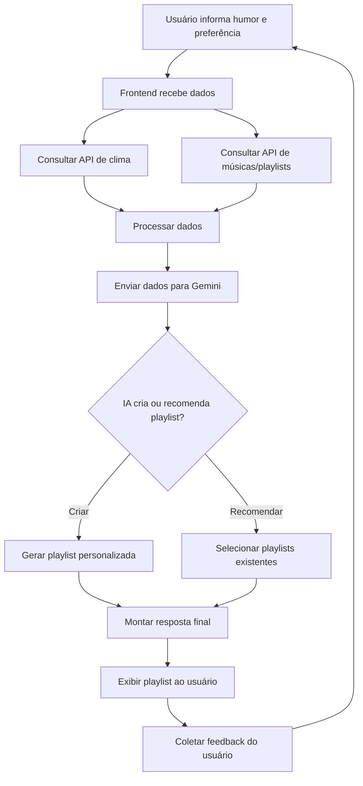

# Playlist-do-momento🎵

## Sobre o Projeto
**Projeto:** Playlist do Momento

**Problema que resolve:** Escolhe a playlist ideal para o momento de acordo com o humor do usuário e o clima do dia.

## Integrantes
| Nome | GitHub |
|------|--------|
| [Leticia Melo] | [@LeticiaMelo2] |
| [Giovanna Rocha] | [@giovannamrocha] |
| [Geovana Romeo] | [@georomeoz] |

## Arquitetura

## Como funciona
 
O usuário informa como está seu humor no momento em que deseja ouvir uma playlist. O sistema recebe essa informação e utiliza APIs externas para consultar dados relevantes, como o clima do dia e possíveis playlists ou músicas adequadas. Em seguida, essas informações são enviadas para a IA (Gemini), que analisa os dados e decide a melhor opção, podendo criar uma playlist personalizada ou recomendar playlists já existentes. O sistema apresenta ao usuário uma playlist adequada ao seu humor e ao contexto analisado. Após isso, o usuário pode fornecer um feedback sobre a recomendação, permitindo que o sistema melhore continuamente suas sugestões.
